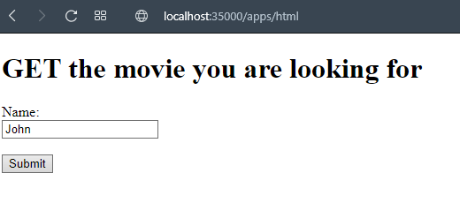
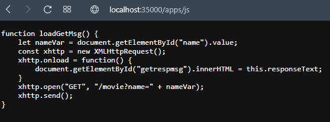
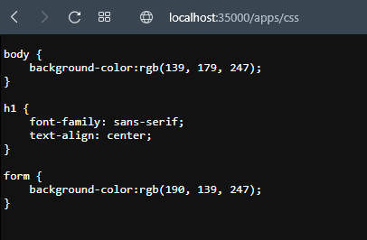

## Escuela Colombiana de Ingeniería
# ARQUITECTURAS DE SERVIDORES DE APLICACIONES, META PROTOCOLOS DE OBJETOS, PATRÓN IOC, REFLEXIÓN

Servidor Web (tipo Apache) contruido en Java capaz de entregar páginas html e imágenes tipo PNG que provee un framework IoC para la construcción de aplicaciones web a partir de POJOS y atiende múltiples solicitudes no concurrentes.

## Clonación del proyecto

Para descargar este proyecto, debe ejecutar el siguiente comando para descargar el proyecto:

```
https://github.com/JuanPablo70/AREP-TALLER04.git
```

### Prerrequisitos

Para hacer uso de esta aplicación debe tener conocimientos de:
+ Java - Lenguaje de programación orientado a objetos.
+ Maven - Herramienta para automatizar la gestión y construcción de proyectos Java. 

### Ejecución de la aplicación

Para ejecutar la aplicación, debera en la línea de comandos (cmd) ubicarse en la carpeta donde se clonó el proyecto y ejecutar el siguiente comando:

```
mvn clean package exec:java -D "exec.mainClass"="edu.eci.arep.app.App"
```

También se puede ejecutar con el siguiente comando sin necesidad de utilizar maven:

```
java -cp target/classes edu.eci.arep.app.App
```

Cuando se muestre el mensaje "Listo para recibir ...", ingrese al siguiente enlace http://localhost:35000/apps/html. 

## Test

Como pruebas, para este taller se probó el funcionamiento del proyecto ingresando a los siguientes enlaces:

http://localhost:35000/apps/html



http://localhost:35000/apps/png

Con la imagen no se porqué no la muestra.

http://localhost:35000/apps/js



http://localhost:35000/apps/css



Donde en cada uno de ellos como se puede ver, el servidor fue capaz de entregar páginas html y archivos png, js y css.

## Construido con

+ [Maven](https://maven.apache.org/) - Dependency Management

## Versión

1.0

## Autor

Juan Pablo Sánchez Bermúdez

## Descripción del proyecto

Para el desarrollo de este proyecto se hizo la creación de dos anotaciones importantes, ```@Component``` y ```@RequestMapping``` que simulan el funcionamiento de Spring.

### @Component

Esta anotación indica que clases deben tenerse en cuenta para hacer uso de la anotación ```@RequestMapping```. En este proyecto solo ```WebSercice``` tiene esta anotación.

### @RequestMapping

Esta anotación indica que métodos pueden invocar el servicio que se ingrese en la URL si estos tienen esta anotación.